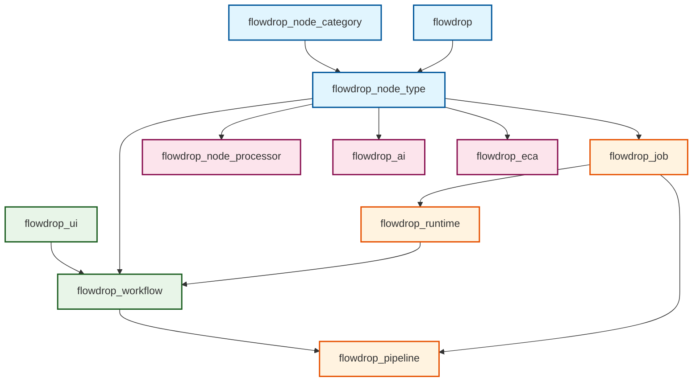

# FlowDrop Module Dependency Graph

This document provides a visual representation of the FlowDrop module dependencies and relationships using Mermaid.js.

## Module Dependency Graph

```mermaid
graph TD

    FD_NODE_CATEGORY[flowdrop_node_category] --> FD_NODE_TYPE
    FD[flowdrop] --> FD_NODE_TYPE[flowdrop_node_type]
    FD_UI[flowdrop_ui] --> FD_WORKFLOW[flowdrop_workflow]


    FD_NODE_TYPE --> FD_JOB[flowdrop_job]
    FD_WORKFLOW[flowdrop_workflow] --> FD_PIPELINE[flowdrop_pipeline]
    FD_JOB[flowdrop_job] --> FD_PIPELINE[flowdrop_pipeline]
    FD_NODE_TYPE --> FD_WORKFLOW[flowdrop_workflow]

    FD_JOB --> FD_RUNTIME[flowdrop_runtime]
    FD_NODE_TYPE --> FD_NODE_PROCESSOR[flowdrop_node_processor]

    FD_NODE_TYPE --> FD_AI[flowdrop_ai]
    FD_NODE_TYPE --> FD_ECA[flowdrop_eca]
    FD_RUNTIME --> FD_WORKFLOW

    %% Styling
    classDef coreModule fill:#e1f5fe,stroke:#01579b,stroke-width:2px
    classDef entityModule fill:#f3e5f5,stroke:#4a148c,stroke-width:2px
    classDef uiModule fill:#e8f5e8,stroke:#1b5e20,stroke-width:2px
    classDef processingModule fill:#fff3e0,stroke:#e65100,stroke-width:2px
    classDef externalModule fill:#fce4ec,stroke:#880e4f,stroke-width:2px

    class FD,FD_NODE_TYPE,FD_NODE_CATEGORY, coreModule
    class FD_UI,FD_MODELER,FD_WORKFLOW uiModule
    class FD_PIPELINE,FD_JOB,FD_RUNTIME processingModule
    class FD_AI,FD_ECA,FD_NODE_PROCESSOR externalModule
```
