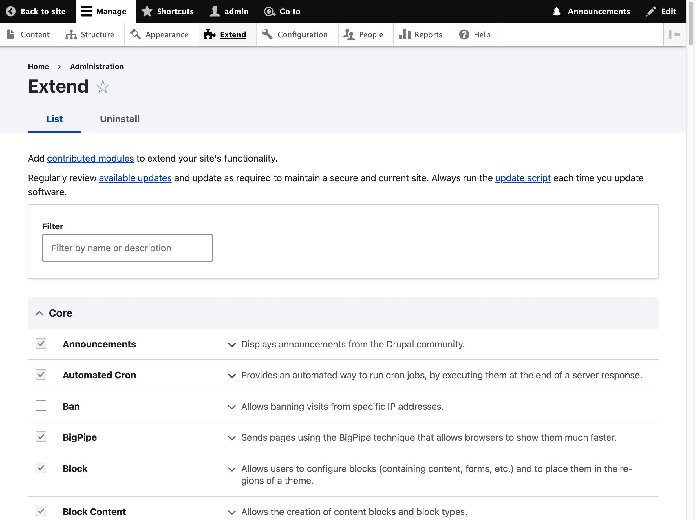
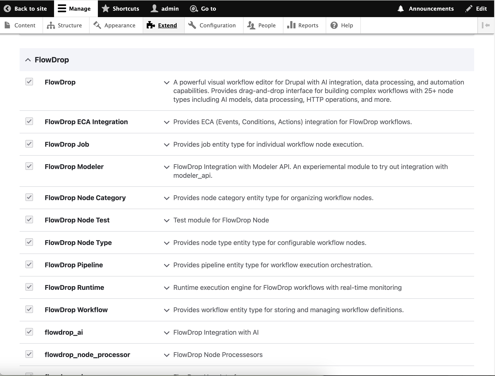
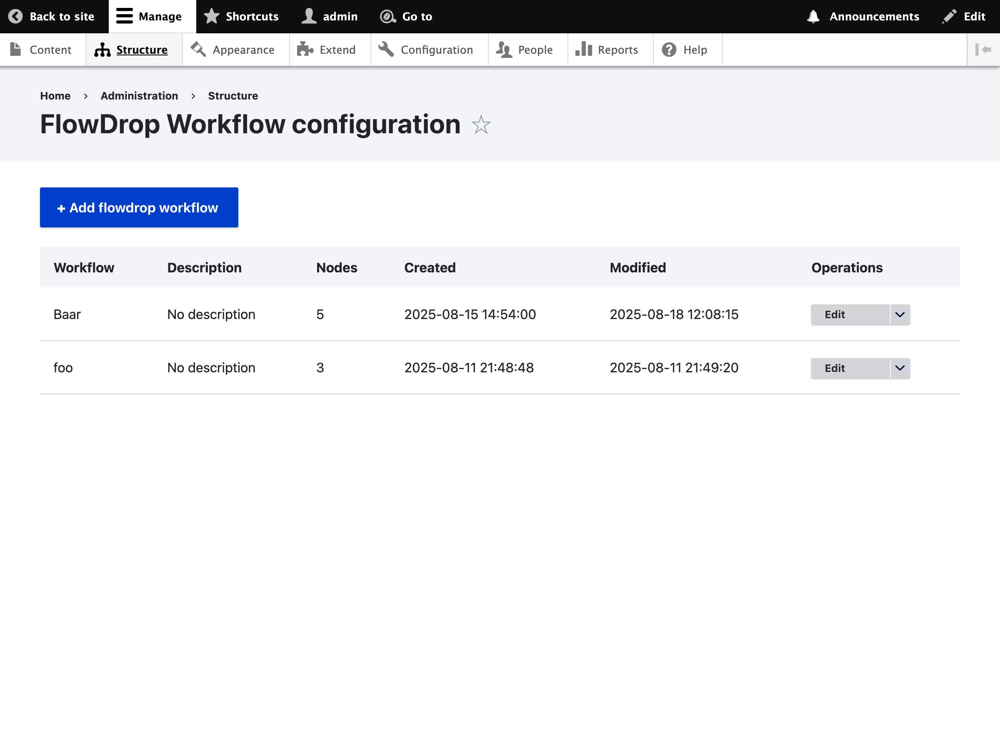
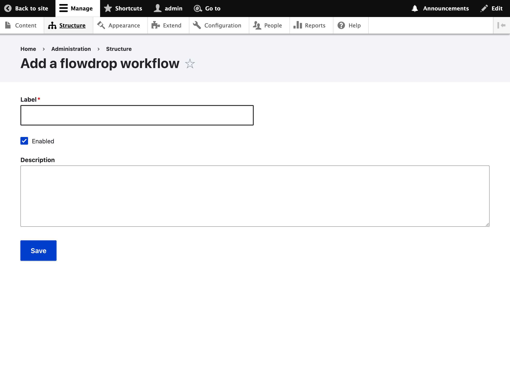
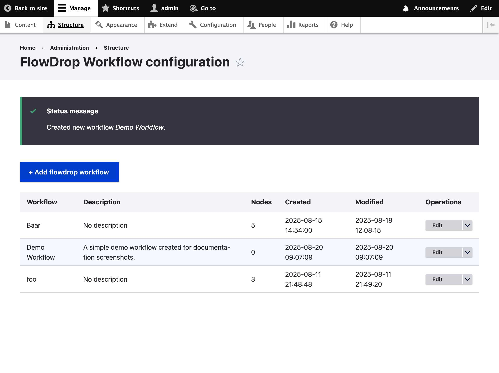
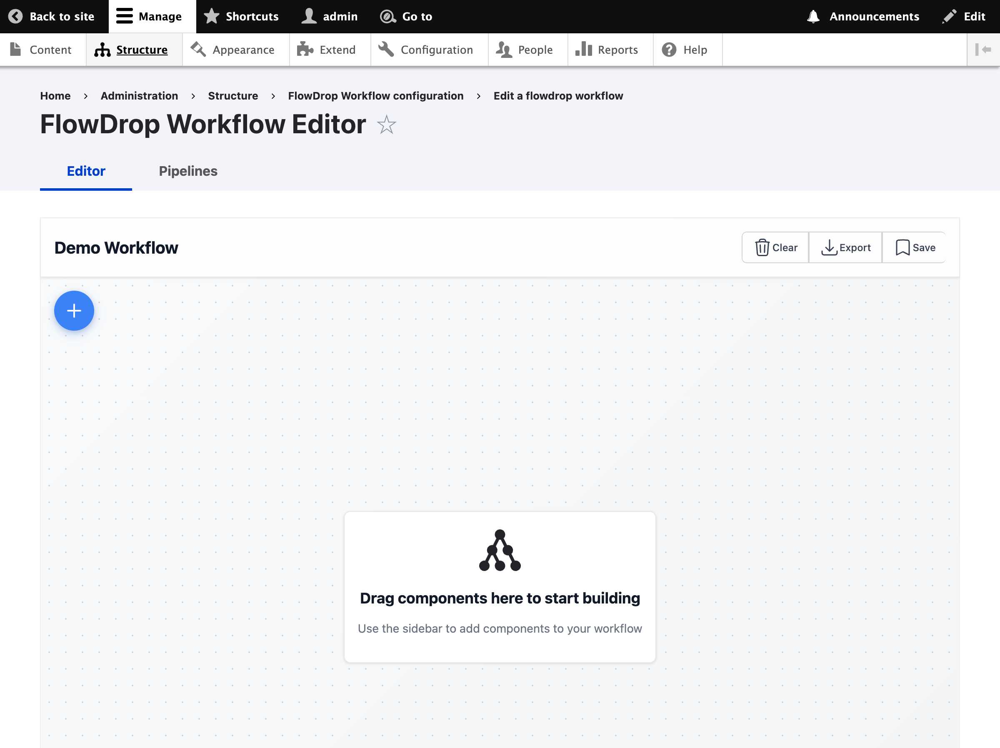

# Getting Started

Follow these simple steps to create and edit your first FlowDrop workflow.

## Enable the module

   - Go to Extend (`/admin/modules`) and make sure the **FlowDrop Workflow** module is enabled.

   

   

## Create a workflow

   - Go to `/admin/structure/flowdrop-workflow` and click **+Add flowdrop workflow**.
   - Enter a **Label** and optional **Description**, then click **Save**.

   

   

   

## Open the workflow in the editor

   - From the workflow listing, open **List additional actions** and click **Open in Editor**.

   

## Build and save

   - In the editor, drag components onto the canvas to build your workflow, then click **Save**.
   - **Don't forget to click on "+" button on left side to see available nodes to drag and drop.**

   

## What's Next?

- Manage "FlowDrop node" by visiting "Structure >> FlowDrop Node Type" `/admin/structure/flowdrop-node-type`.
- There is a 1:M relationship between FlowDrop Node Processor (defined in code) and "Flowdrop Node Type"
  This way, you can define one processor in code and have multiple Node type with different config. A very
  common business need.

