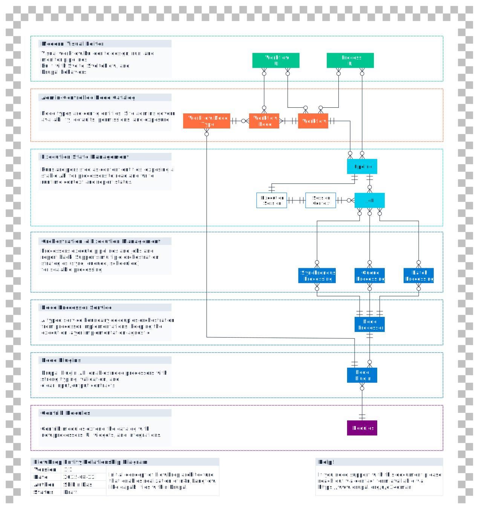

# Architecture

Initial concept of FlowDrop architecture
that enables realization of n8n/Langflow
like capabilities within Drupal

## Entity Relationship Diagram of FlowDrop

*Figure: Entity Relationship Diagram of FLowdrop*

??? tip "About wierd symbols instead of arrows."
    [Craw's Foot Notation](https://en.wikipedia.org/wiki/Entity%E2%80%93relationship_model#Crow's_foot_notation) is used to represent cardinality in the Entity Relationship Diagram.

    Three symbols are used to represent cardinality:

    - the ring represents "zero"
    - the dash represents "one"
    - the crow's foot represents "many" or "infinite"

## Main architectural layers of FlowDrop

### Modern Visual Editor

Visual workflow builder to design, run, and monitor pipelines. Built with Svelte, SvelteFlow, and Drupal behaviors.

### Admin-Controlled Node Catalog

Node types are config entities. Site admins govern availability, defaults, permissions, and exposure.

### Execution State Management

Runs are persisted as content entities, exposing a stable API for processors to read and write runtime context and report status.

### Orchestration & Execution Management

Processors execute pipelines and jobs and report back. Supports multiple orchestration strategies (sync, queued, scheduled) for scalable processing.

### Node Processor Service

A typed service boundary decouples orchestration from processor implementations, keeping the execution layer implementation-agnostic.

### Node Plugins

Drupal Plugin API enables node processors with strong typing, validation, and clear input/output contracts.

### Contrib Modules

Contrib modules extend the catalog with new processors, UI widgets, and integrations.

## Technical Note

- Layered architecture enables modularity and extensibility.
- New orchestrators can be introduced without modifying other layers.
- Additional UIs can be added without breaking changes.
- Can be used programmatically (headless) without the UI.
- Workflows can be processed independently of the UI layer.

!!! example "How it works"

    - **Define**: Model nodes and connections in the visual editor.
        - UI: [SvelteFlow](https://svelteflow.dev/) + [Svelte](https://svelte.dev/) + [Drupal Behaviors](https://www.drupal.org/docs/drupal-apis/javascript-api/javascript-api-overview)
    - **Map**: Convert Workflow to an executable, typed graph via the mapper service.
    - **Configure**: Manage node types as config entities (availability, defaults, permissions).
    - **Run**: Start executions via the controller; create session records that carry runtime context across nodes.
    - **Orchestrate**: Execute nodes synchronously or via queues/schedules; report progress and results back to the session.
    - **Observe & Store**: Persist execution state, logs, and artifacts as content entities for monitoring, replayability, and auditing.
