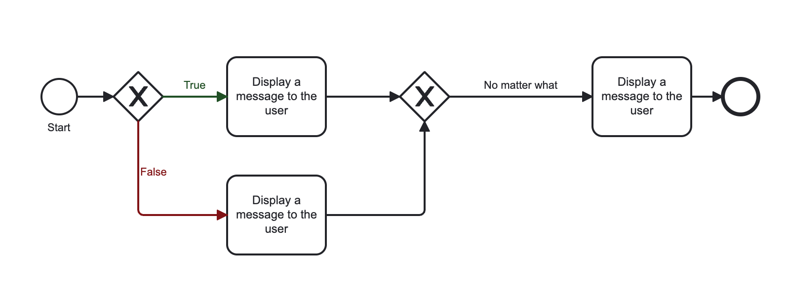
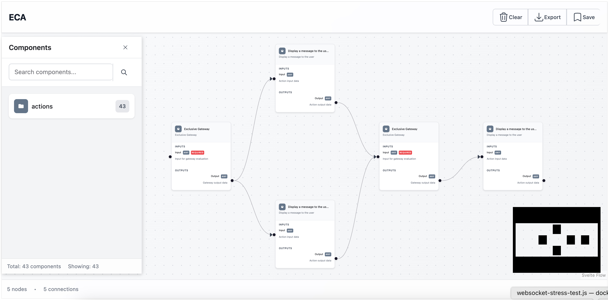
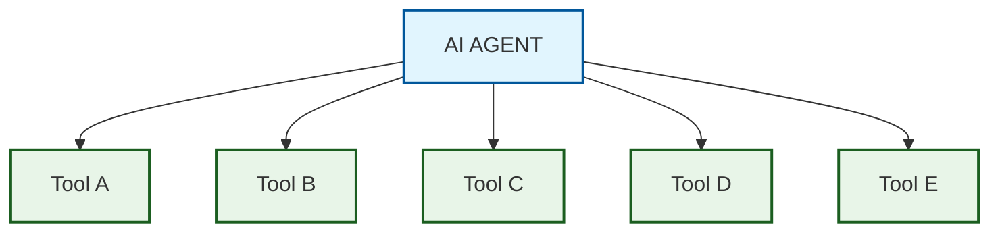
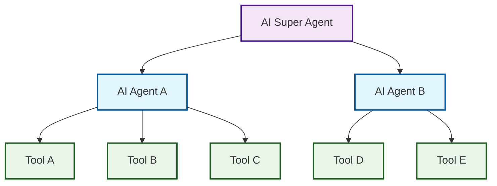
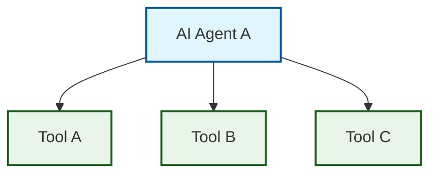
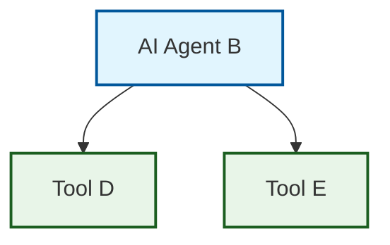
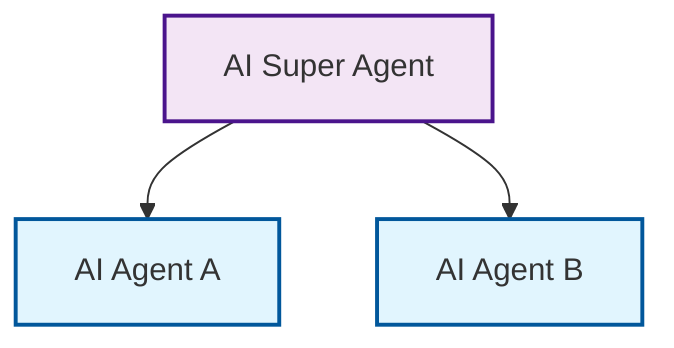
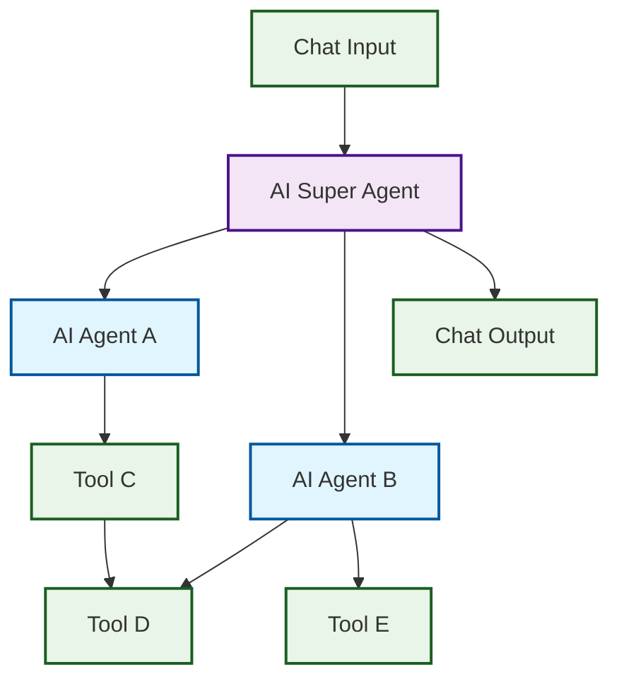

# Modeler API

**Date** : 2024-08-22 • **status** : Ready • **Author** : Shibin Das (d34dman)

## Background

Modeler API is impressive :heart:

The Modeler API provides an API for modules like ECA - Events, Conditions, Actions, Migrate Visualize, AI Agents, and maybe others. The purpose is to allow those modules to utilize modelers like BPMN.io (and maybe others in the future) to build diagrams constructed of their components (e.g. plugins) and write them back into module-specific config entities.

**Main claim includes**

- Config owners and UIs (modelers) don't know anything about each other's capabilities or business logic
- Both ends can be replaced without losing any data:
  - users can edit configuration with the UI of their choice
  - the same config can be edited with different UIs
  - different config can be edited with the same UI, users don't have to learn new tools every time
- Developers should be able to focus on either the config owner or the UI, not both together
- Modeler API also provides all the generics like routing, list building, permissions, menu integration, logging, etc.

## Experiments

### A: "BPMN.io" Model Owner

Thanks to onboarding from Jurgen Haas, maintainer of Modeler API, I was able to
develop a proof of concept quickly. After writing a few processors to massage the data and some
auto-layout logic, we achieved the following.

| BPMN.io | FlowDrop UI|
| --- | --- |
|  |  |
| A workflow created using BPMN.io | The same workflow opened using FlowDrop UI based modeler |

**Learnings**

!!! success
    
    - **Abstraction validated with POC**: The Modeler API provides sufficient abstraction. The proof of concept shows that FlowDrop UI can visualize an ECA workflow generated with the BPMN.io modeler.

!!! warning "Risk"
    
    - **Integrated configuration editing not yet available**
    Updating configuration within the workflow is not yet exposed by the Modeler, which limits FlowDrop UI's ability to provide integrated configuration management.
    - **Risk of becoming a themed variant of BPMN.io**
    With the current Model Owner, FlowDrop UI could effectively become a themed variant of the BPMN.io modeler. If editing is off-loaded into modal forms, FlowDrop UI's main contribution may be a different drag-and-drop experience and styling.

!!! note
    This critique should not be considered a shortcoming of ECA/BPMN.io. It reflects that the architecture it is based on does not currently align with the needs of a LangFlow/n8n-style workflow. This opinion may change in the future as the maintainers work to bring first-class support for AI to ECA.

### B: "AI Agents" Model Owner

#### B.1: Simple agent scenario

The model comprises a single node connected to multiple nodes and configurations.

#### B.2: Super agent and sub-agent scenario

To model a more complex workflow, we can nest agents within agents.

Let's say we want a slightly more complex agent workflow as follows.

A super agent "AI Super Agent" has access to two AI agents - "AI Agent A" and "AI Agent B".
These sub-agents themselves have access to various tools.

 We start by
creating "AI Agent A", which has access to Tool A, Tool B, and Tool C.

Then we create "AI Agent B", which has access to Tool D and Tool E.

Finally, we create the "Super Agent", which uses "AI Agent A" and "AI Agent B".

**Learnings**

!!! warning "Risk"
    
    - **Hierarchical editing UX is complex**: The user experience when editing hierarchical agent workflows is complex and not ideal.
    - **In-workflow configuration editing not available**: Updating configuration within the workflow is not yet exposed by the Modeler, which limits FlowDrop UI's integrated configuration management.
    - **Limited net UI benefit today**: Even with the BPMN.io modeler, the UI currently provides limited advantages; users still spend most of their time in Drupal's Edit form configuring the agent.

!!! question
    
    - **Nested agent creation from a single model?** Can the AI Agent Model owner provide nested agent creation from a single model?

#### B.3: Agents orchestration

An AI agent orchestration can involve multiple agents and sub-flows that form loops and feedback systems. It is cumbersome to visit multiple UIs provided by AI Agent and ECA to configure this. The user experience is discouraging.

The following example is relatively simple, yet it proves complex to set up with the current approach.

**Learnings**

!!! warning "Risk"
    
    - **Architecture limited by Model Owner**
    Limiting FlowDrop capability to the BPMN model (and thereby the ECA ecosystem in general) is a double-edged sword. You benefit from the large number of plugins, but you also have to respect the architecture and its limitations.

## Conclusion

The current state of the Modeler API, ECA, and AI integrations is promising. While it does not yet deliver the end-to-end experience FlowDrop envisions, the direction is encouraging. In the interim, we will use focused, maintainable custom implementations to achieve the desired UX, with the intent to adopt native capabilities as the ecosystem evolves.

## References

 - [Drupal's Modeler API released - learn about the benefits](https://www.lakedrops.com/en/blog/drupals-modeler-api-released-learn-about-benefits)